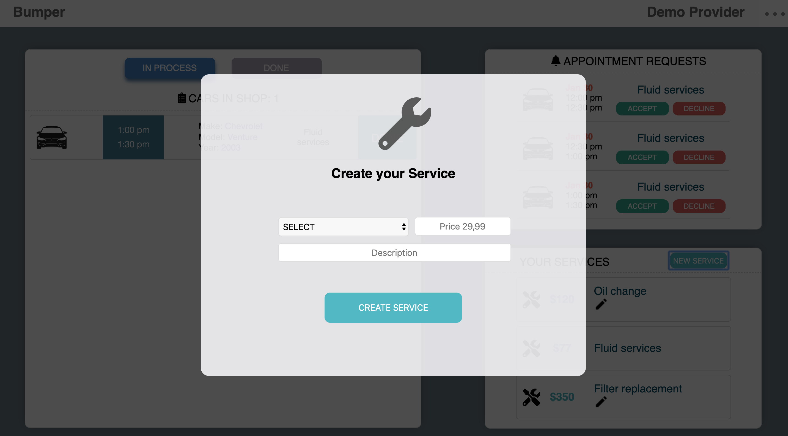

# Bumper

Bumper brings together car owner and service provider. Car serivce provider (like mechanics or washing services etc.) can create and share their services which then can be booked by car owner. 

For services provider Bumper works like a CRM tool. They get nofitications about new appointments and can manged them in their dashboard.
Car owner on the other side are able to quickly book the car service they need.

At a later stage Bumper plans to integrate the smartcar API to work with real time car data.
With that live data car owner can manage their car's efficient. They will be informed about upcoming oil changes or other general car services.

[take a look](https://immense-scrubland-89264.herokuapp.com/#/)
***

## **Features**
## Home page

## User roles
* User can choose bewtween two different user roles: car service provider and car owner who have different functionalites. 
* Car service provider have to create their business with the sign up. Among general information they enter location and business hours. 
 

## Provider dashboard
* The provider dashboard hold the functionality aviable for the provider role. It is the  centrepiece for the provider CRM. 

* Provider can manage their services. When creating a service they can select the service type, enter the price and optional add a description. Provider can edit and delete their services at any time.

 * Notifications inform the provider about new appointments. They can decide to accept or decline the appointments.
 
 
 * In the appointment feed provider can manage their accepted appointments. They see necesarry information and can marked it as done or in progress.

 ## **Technologies**
 Bumper is build with  MERN Stack. 

 ### Backend
 * Node.s
 * MongoDB
 * Express

 ### Frotend
 * React

 ### Workflow and project management
 * Bumper is a group project. To esnure a effective, structured and smooth team work we used a agile project management approach with git workflow, kanban and daily standup meetings.

