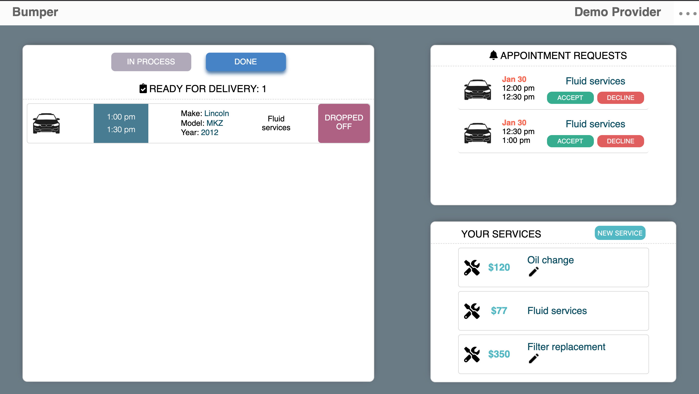

# Bumper

Bumper connects car owners and service providers to provide convenient, on-demand car maintenance. Car service providers, such as mechanics or car wash facilities, can create and share their services which then can be booked by car owner. 

For service providers, Bumper works as a CRM tool. A provider gets nofitications about new appointments and can manage them in a user-friendly dashboard.
Car owners, on the other hand, are able to quickly book the car service they need.

At a later stage Bumper plans to integrate the Smartcar API to work with real-time car data.
With live data, a car owner can manage their car efficiently. They will be informed about upcoming oil changes or other general car services.

[take a look](https://immense-scrubland-89264.herokuapp.com/#/)
***

## **Features**
## Home page

## User roles
* User can choose bewtween two different roles: car service provider and car owner. Each account type has different functionalities. 
* Car service provider has to create their business at time of registration. Among general registration information, they enter their store location and business hours. 
 

## Provider dashboard
* The provider dashboard holds the functionality aviable for the provider role. It is the centerpiece for the provider CRM. 

* Providers can manage their services. When creating a service they can select the service type, enter the price, and optionally add a description. Providers can edit and delete their services at any time.

 * Notifications inform the provider about new appointments. They can decide to accept or decline the appointments.
 
 
 * In the appointment feed, providers can manage their accepted appointments. They see necessary information and can mark the appointment as complete or in progress.

 ## **Technologies**
 Bumper is built with MERN Stack. 

 ### Backend
 * Node.js
 * MongoDB
 * Express

 ### Frontend
 * React
 * Redux
 * SCSS
 ### Workflow and project management
 * Bumper is a group project. To ensure an effective, structured and smooth execution we used an agile project management approach with git workflow, Kanban, and daily standup meetings.

